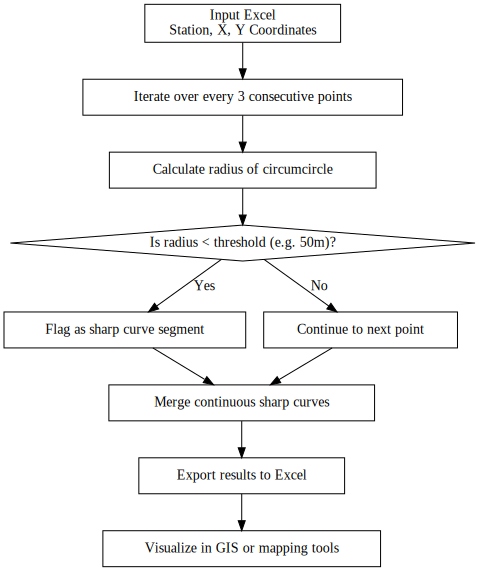

# 📏 Sharp Curve Detector

A Python-based tool for automatically detecting sharp curves in road centerline data. Designed for large-scale survey analysis and roadway safety evaluations in Taiwan.

---

## 🧠 Background

In traditional road survey workflows, engineers manually calculate curve radii based on centerline coordinates to identify sharp turns. This process is time-consuming and error-prone, especially for long road networks.

This tool automates the detection process and provides a flexible, extensible pipeline for post-survey analysis and road safety evaluation.

---

## 🚧 Features

✅ Read road centerline coordinates from an Excel file (station, X, Y)  
✅ Calculate circle radius using any 3 consecutive points  
✅ Flag segments with radius < 50m  
✅ Merge continuous sharp curve segments into longer sections  
✅ Export results to Excel for reporting and mapping

---

## 🧭 Processing Flow
The following diagram illustrates the logic used by the Sharp Curve Detection Tool to process input coordinate data and generate output reports for sharp curve segments:


## 🧮 Step-by-step Logic:

The following diagram shows the sharp curve detection logic:




---

## 🗂️ Input File Format

Your input `.xlsx` must contain **3 columns**:
- `Station` — chainage or stake number(道路中心線公尺樁) 
- `X` — X coordinate（坐標建議為TWD97 TM2）
- `Y` — Y coordinate（坐標建議為TWD97 TM2）

Example:
| Station | X       | Y       |
|---------|---------|---------|
| 0K+000  | 255999  | 2709999 |
| 0K+001  | 256000  | 2710000 |
| ...     | ...     | ...     |

## 👤 Author

[@alexintw](https://github.com/alexintw)

Feel free to open an issue or pull request!
---

## ⚙️ Install

1️⃣ Clone this repository  
```bash
git clone https://github.com/alexintw/sharp-curve-detector.git
cd sharp-curve-detector

pip install -r requirements.txt

python sharp_curve.py --input path/to/your_input.xlsx --output path/to/output.xlsx
Parameters:

--input : Path to your input Excel file
--output : Optional. Path to save the output Excel. Default: sharp_curves_output.xlsx

python sharp_curve.py --input examples/sample_input.xlsx --output sharp_curves_output.xlsx
